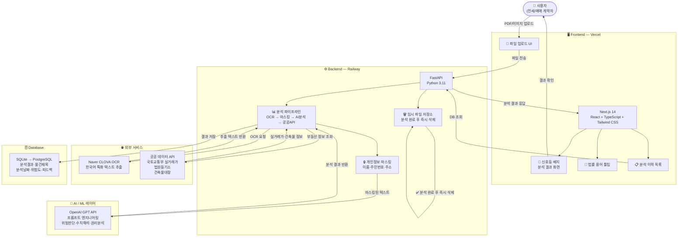

# 등기부 등본 AI 해석기

AI/ML (인공지능/머신러닝) · 완성도 7/7 섹션

---

## 1. 프로젝트 프로필

| 항목 | 내용 |
|---|---|
| 프로젝트명 | 등기부 등본 AI 해석기 |
| 유형 | AI/ML (인공지능/머신러닝) |
| 언어 | ko |

> 등기부 등본을 업로드 하면, AI가 이 문서에 대해서 해석해주고, 해당 집에 대한 정보를 가져와서 안전한 지 위험한 지에 대해서 판단 및 해석을 제공함

**대상 사용자**

- 전세/매매 계약을 앞둔 일반인
- 비전문가 ~ 중간 수준 (등기부 등본에 익숙하지 않은 일반인 포함)
- 반복 사용 (여러 매물 비교 시 반복적으로 활용)

**해결하는 문제**

- 위험 항목 판단 불가, 수치 해석 어려움
- 법률 용어 생소함, 전문가 비용 부담

**핵심 기능**

- SQLite
- PostgreSQL
- AI 안전/위험 판단
- 비전문가 친화적 결과 설명
- 위험도 요약 배지 (신호등 UI) — 분석 결과를 🟢안전/🟡주의/🔴위험으로 한눈에 표시
- 위험 항목 용어 툴팁 — 법률 용어에 마우스 오버 시 쉬운 설명 팝업

**성공 지표**

- 테스트셋 평가 — 정답이 알려진 등기부 등본 샘플로 정기 테스트
- 사용자 피드백 — '도움이 됐나요?' 버튼으로 수집

**리스크 · 대응**

- OCR 인식률 저하 — 저화질/스캔 이미지에서 정확도 하락 가능
- AI 분석 오류 — 복잡한 등기부 등본 문서 잘못 해석 가능
- 딱히 없음
- 개인정보보호법(PIPA) 준수 — 개인정보 처리 방침 수립 및 고지 의무
- 법적 면책 조항 — AI 분석 결과는 참고용이며 법적 효력 없음을 명시

**데이터 · 입력**

- 사용자 업로드 등기부 등본 (PDF, 이미지 복합 지원)
- 공공 API (법원 등기소, 국토교통부 실거래가, 건축물 대장 등)
- 민간 API 제외, 공공 API만 활용
- 개인정보 마스킹 처리 후 분석 (OCR 단계에서 이름, 주민번호, 주소 등 패턴 감지 후 마스킹)
- 있음 (등기부 등본 내 소유자 정보 등)
- 분석 완료 즉시 삭제
- 분석 결과 + 물건 제목(건물명/동호수) + 분석 날짜만 저장
- Naver CLOVA OCR (한국어 특화)
- GPT 프롬프트 기반 + 공공 데이터(AI Hub 등)로 테스트셋 구축

**기술 · 인프라**

- Next.js (React 기반)
- OpenAI GPT 최신 버전
- Vercel
- Railway

**기타**

- 등기부 등본 문서를 AI로 분석·해석하고, 부동산 안전성을 자동 판단해주는 서비스
- 1회 계약 검토 시 평균 3~5개 매물 비교 기준으로 설계
- 비전문가 친화적 설명 — 직관적 안전/위험 판단 제공
- 24/7 접근성 — 언제 어디서든 즉시 확인 가능
- 비용 절감 — 전문가 상담 없이 무료/저렴하게 이용
- 누구나 전문가 없이도 부동산 계약 위험을 스스로 판단할 수 있다
- AI 분석 정확도 90% 이상
- GPT 프롬프트 엔지니어링 (파인튜닝 없음)
- 서버 기반 (Server-side) — 사용자 업로드 후 서버에서 GPT API 호출
- 90% 이상
- 전 항목 동일 기준 적용
- 위험도 요약 배지 (신호등 UI) (난이도: 낮, 시간: 반나절~1일)
- 매물 비교 뷰 (난이도: 중, 시간: 2~3일)
- 위험 항목 용어 툴팁 (난이도: 낮, 시간: 1일)
- 분석 결과 PDF 내보내기 (난이도: 중, 시간: 1~2일)
- 재분석 알림 (난이도: 높, 시간: 3일 이상)

## 2. 기능 정의

- `MUST` 사용자는 등기부 등본 파일(PDF 및 이미지)을 시스템에 업로드할 수 있어야 한다
  - 완료기준: PDF, JPG, PNG 형식의 파일을 업로드할 수 있으며, 업로드 후 10초 이내에 OCR 처리가 시작된다. 파일 크기는 최대 20MB를 지원한다.
- `MUST` 시스템은 Naver CLOVA OCR을 활용하여 업로드된 등기부 등본 문서에서 텍스트를 추출해야 한다
  - 완료기준: 한국어 텍스트 인식률 90% 이상을 달성하며, OCR 처리 완료 후 추출된 텍스트가 AI 분석 모듈로 전달된다. 저화질 이미지의 경우 재업로드 안내 메시지를 제공한다.
- `MUST` 시스템은 OpenAI GPT를 활용한 프롬프트 엔지니어링으로 추출된 등기부 등본 내용을 분석하고, 위험 판단·금액 수치 해석·권리 관계 분석 결과를 제공해야 한다
  - 완료기준: 위험 판단, 금액 수치 해석, 권리 관계 분석 각 항목에서 90% 이상의 정확도를 달성한다. 분석 결과는 안전/주의/위험 3단계로 분류되어 제공된다.
- `MUST` 시스템은 분석 결과를 🟢안전 / 🟡주의 / 🔴위험 신호등 UI 배지로 한눈에 표시해야 한다
  - 완료기준: 분석 결과 화면 최상단에 신호등 배지가 표시되며, 각 등급(안전/주의/위험)에 해당하는 색상과 텍스트가 명확히 구분된다. 배지 클릭 시 판단 근거 요약이 표시된다.
- `MUST` 시스템은 분석 결과를 법률 전문 지식이 없는 일반인도 이해할 수 있는 쉬운 언어로 설명해야 한다
  - 완료기준: 분석 결과 설명에 법률 용어 단독 사용을 지양하고, 일상 언어로 풀어 설명한다. 사용자 피드백 '도움이 됐나요?' 버튼을 통해 측정한 만족도가 80% 이상이어야 한다.
- `MUST` 시스템은 OCR 처리 단계에서 등기부 등본 내 소유자 이름, 주민번호, 주소 등 개인식별정보를 자동으로 감지하여 마스킹 처리해야 한다
  - 완료기준: 정규식 및 NER 패턴 기반으로 이름, 주민등록번호(13자리), 주소 패턴을 감지하고 '***' 형태로 마스킹한다. 마스킹 처리 후 원본 데이터는 분석 완료 즉시 서버에서 삭제된다.
- `MUST` 시스템은 분석 완료 후 원본 등기부 등본 파일을 즉시 삭제하고, 분석 결과·물건 제목(건물명/동호수)·분석 날짜만 보관해야 한다
  - 완료기준: 분석 완료 후 5분 이내에 원본 파일이 서버에서 완전 삭제된다. 저장되는 데이터는 분석 결과, 물건 제목, 분석 날짜 3가지로 제한되며, 이 외 개인정보는 저장되지 않는다.
- `MUST` 시스템은 공공 API(법원 등기소, 국토교통부 실거래가, 건축물 대장)와 연동하여 분석 대상 부동산의 외부 정보를 자동으로 수집해야 한다
  - 완료기준: 공공 API 연동을 통해 실거래가, 건축물 대장 정보가 분석 결과에 자동 반영된다. API 호출 실패 시 해당 항목에 '외부 데이터 조회 불가' 안내를 표시하고 나머지 분석은 정상 제공한다.
- `SHOULD` 분석 결과 화면에서 '근저당권', '가압류', '전세권', '지상권' 등 법률 용어에 마우스 오버(또는 터치) 시 쉬운 설명 툴팁이 표시되어야 한다
  - 완료기준: 등록된 법률 용어 전체에 툴팁이 적용되며, 툴팁 설명은 중학교 수준의 언어로 2~3문장 이내로 작성된다. 모바일에서는 탭(터치) 시 툴팁이 표시된다.
- `SHOULD` 사용자는 과거 분석 이력(물건 제목, 분석 날짜, 위험도 등급)을 목록으로 조회할 수 있어야 한다
  - 완료기준: 분석 이력 목록에서 물건 제목, 분석 날짜, 신호등 배지(위험도 등급)가 표시된다. 목록에서 항목 클릭 시 해당 분석 결과 상세 화면으로 이동한다.
- `SHOULD` 등기부 등본 업로드부터 AI 분석 결과 제공까지의 전체 처리 시간이 60초 이내여야 한다
  - 완료기준: OCR 처리 + GPT API 호출 + 공공 API 연동을 포함한 전체 분석 과정이 60초 이내에 완료된다. 처리 중에는 진행 상태 표시(프로그레스 바 또는 단계별 안내)를 제공한다.
- `SHOULD` 서비스 내 모든 분석 결과 화면에 'AI 분석 결과는 참고용이며 법적 효력이 없습니다'라는 법적 면책 조항이 명시되어야 한다
  - 완료기준: 분석 결과 화면 하단에 면책 조항이 항상 표시된다. 서비스 최초 이용 시 면책 조항 동의를 필수로 받으며, 동의 기록이 저장된다.
- `SHOULD` 사용자는 AI 분석 결과에 대해 '도움이 됐나요?' 피드백을 남길 수 있어야 하며, 시스템은 이를 정확도 측정에 활용해야 한다
  - 완료기준: 분석 결과 화면에 긍정/부정 피드백 버튼이 제공된다. 수집된 피드백 데이터는 관리자 대시보드에서 조회 가능하며, 전체 만족도 비율이 집계된다.
- `COULD` 사용자는 AI 분석 결과를 PDF 파일로 내보내어 저장하거나 타인과 공유할 수 있어야 한다
  - 완료기준: 분석 결과 화면에서 'PDF 내보내기' 버튼 클릭 시 신호등 배지, 분석 요약, 위험 항목 설명이 포함된 PDF 파일이 생성되어 다운로드된다. 개인정보 마스킹이 PDF에도 유지된다.
- `COULD` 시스템은 동시 다수 사용자 요청 시에도 안정적으로 동작해야 하며, 서비스 가용성 99% 이상을 유지해야 한다
  - 완료기준: 동시 접속자 50명 기준 응답 시간이 60초 이내로 유지된다. 월간 서비스 가용성이 99% 이상이며, 장애 발생 시 사용자에게 안내 메시지가 표시된다.

## 3. 시스템 구조

**구성 요소**

- **Next.js 프론트엔드** (Next.js 14 (React, TypeScript) + Tailwind CSS, Vercel 배포) — 사용자 인터페이스를 담당하는 웹 애플리케이션. 등기부 등본 파일 업로드, 신호등 UI 배지(🟢안전/🟡주의/🔴위험), 법률 용어 툴팁, 분석 결과 화면, 분석 이력 목록을 제공. Vercel에 배포.
- **FastAPI 백엔드 서버** (FastAPI (Python 3.11), Railway 배포) — 핵심 비즈니스 로직을 처리하는 메인 서버. 파일 수신, OCR 호출, 개인정보 마스킹, GPT 분석 프롬프트 오케스트레이션, 공공 API 연동, 분석 결과 저장·삭제 파이프라인을 순차 처리. Railway에 배포.
- **Naver CLOVA OCR** (Naver CLOVA OCR API (한국어 특화)) — 사용자가 업로드한 등기부 등본 PDF 및 이미지에서 한국어 텍스트를 추출. OCR 결과 반환 후 백엔드에서 개인정보(이름·주민번호·주소) 패턴을 감지하여 마스킹 처리.
- **AI 분석 엔진 (LLM)** (OpenAI GPT API (최신 버전, 프롬프트 엔지니어링)) — 마스킹 처리된 등기부 등본 텍스트를 프롬프트 엔지니어링 방식으로 분석. 위험 판단(안전/주의/위험), 금액 수치 해석(근저당권·채권최고액), 권리 관계 분석(가압류·전세권·지상권)을 수행하여 비전문가 친화적 설명 생성. 목표 정확도 90% 이상.
- **공공 데이터 API 연동** (공공데이터포털 REST API (국토교통부 · 법원등기소 · 건축물대장)) — 분석 대상 부동산의 외부 정보를 자동 수집. 국토교통부 실거래가, 법원 등기소, 건축물 대장 공공 API에서 데이터를 가져와 AI 분석 컨텍스트로 활용. 민간 API는 사용하지 않음.
- **데이터베이스** (SQLite (MVP1) → PostgreSQL (MVP2, Railway 관리형)) — 원본 파일은 저장하지 않으며, 분석 결과·물건 제목(건물명/동호수)·분석 날짜·위험도 등급·사용자 피드백만 보관. MVP1은 SQLite, MVP2는 PostgreSQL로 마이그레이션.
- **임시 파일 스토리지** (서버 임시 디렉토리 (Railway 인스턴스 로컬) 또는 인메모리 처리) — 업로드된 등기부 등본 파일을 OCR 처리 완료 전까지만 임시 보관. 분석 파이프라인 완료 즉시 자동 삭제하여 개인정보보호법(PIPA) 준수.

**기술 스택**

- OCR: Naver CLOVA OCR API
- AI/LLM: OpenAI GPT API (최신 버전, 프롬프트 엔지니어링)
- Backend: FastAPI (Python 3.11)
- Frontend: Next.js 14 (React + TypeScript) + Tailwind CSS
- 공공 API: 국토교통부 실거래가 · 법원등기소 · 건축물대장 공공데이터포털
- Backend 배포: Railway
- Database (MVP1): SQLite
- Database (MVP2): PostgreSQL (Railway 관리형)
- Frontend 배포: Vercel

**1. 분석 파이프라인 순서 (중요)**
파일 수신 → 임시 저장 → CLOVA OCR 텍스트 추출 → 개인정보 마스킹 (정규식 패턴 감지) → 마스킹된 텍스트로 공공 API 부동산 정보 조회 → GPT 프롬프트로 통합 분석 → 결과 DB 저장 → 임시 파일 즉시 삭제. 이 순서를 반드시 지켜야 개인정보보호법(PIPA) 준수 가능.

**2. 개인정보 마스킹**
백엔드 FastAPI에서 OCR 결과 텍스트에 대해 Python 정규식으로 주민번호 패턴(000000-0000000), 전화번호, 이름(성+이름 패턴) 등을 감지 후 마스킹. 마스킹된 텍스트만 GPT에 전달.

**3. GPT 프롬프트 설계**
'너는 등기부 등본 전문 분석 AI다. 아래 내용을 바탕으로 ① 안전/주의/위험 판단 ② 위험 이유 쉬운 설명 ③ 주요 권리 관계 요약을 JSON 형태로 반환해라' 형태의 시스템 프롬프트 + 마스킹된 OCR 텍스트 + 공공 API 수집 데이터를 합산하여 단일 API 호출로 처리 권장 (토큰 절약 + 응답 시간 최소화).

**4. 공공 API 연동 시 주의**
국토교통부·법원등기소·건축물대장 공공 API는 일 요청 제한(Rate Limit)이 있으므로, 백엔드에서 응답 결과를 DB에 캐싱하여 동일 주소 중복 호출 방지.

**5. 처리 시간 60초 이내 목표**
CLOVA OCR 응답(약 3~10초) + 공공 API 조회(병렬 처리, 약 2~5초) + GPT 응답(약 10~20초) 기준 합산 약 20~35초 예상. 프론트엔드에서 진행 상태 표시(스피너 + 단계별 메시지)로 사용자 체감 대기 시간 완화 권장.

**6. MVP1 → MVP2 마이그레이션**
SQLite → PostgreSQL 전환 시 SQLAlchemy ORM을 사용하면 DB 변경 시 코드 수정 최소화 가능. Railway에서 PostgreSQL 플러그인 추가로 전환 가능.

**7. 법적 면책 조항**
모든 분석 결과 응답 JSON에 disclaimer 필드를 포함하여 프론트엔드에서 반드시 렌더링하도록 구조화 권장.

## 4. 데이터 구조

**users** — 서비스 이용자 정보 (선택적 회원 기능, 비로그인 세션도 지원)

| 필드 | 타입 | 제약 | 설명 |
|---|---|---|---|
| session_id | text | UNIQUE, NOT NULL, INDEX | 비로그인 사용자 세션 식별자 |
| email | text | UNIQUE, NULLABLE | 회원 이메일 (선택) |
| nickname | text | NULLABLE | 표시 이름 |
| is_active | boolean | NOT NULL, DEFAULT true | 계정 활성 여부 |

**analysis_requests** — 등기부 등본 분석 요청 단위. 원본 파일은 저장하지 않으며 처리 상태 및 메타데이터만 보관

| 필드 | 타입 | 제약 | 설명 |
|---|---|---|---|
| user_session_id | text | FK(users.session_id), NOT NULL, INDEX | 요청자 세션 식별자 (users.session_id 참조) |
| property_title | text | NOT NULL | 물건 제목 (건물명/동호수 등 사용자 입력 또는 OCR 추출) |
| status | text | NOT NULL, DEFAULT 'PENDING', INDEX | 처리 상태 (PENDING, OCR_PROCESSING, AI_ANALYZING, COMPLETED, FAILED) |
| file_mime_type | text | NULLABLE | 업로드 파일 형식 (application/pdf, image/jpeg 등) |
| completed_at | timestamp | NULLABLE | 분석 완료 시각 |
| deleted_at | timestamp | NULLABLE | 소프트 삭제 시각 |

**analysis_results** — AI 분석 완료 결과. 신호등 위험도, 비전문가 설명, 항목별 분석 내용을 보관

| 필드 | 타입 | 제약 | 설명 |
|---|---|---|---|
| request_id | uuid | FK(analysis_requests.id), NOT NULL, UNIQUE, INDEX | 분석 요청 식별자 (analysis_requests.id 참조) |
| risk_level | text | NOT NULL, INDEX | 종합 위험도 등급 (SAFE, CAUTION, DANGER) |
| summary_text | text | NOT NULL | 비전문가 친화적 종합 요약 설명 |
| risk_items | jsonb | NOT NULL, DEFAULT '[]' | 위험 항목 목록 [{item, level, plain_description}] |
| financial_analysis | jsonb | NULLABLE | 금액 수치 해석 결과 (근저당권액, 채권최고액, 실거래가 대비 비율 등) |
| rights_analysis | jsonb | NULLABLE | 권리 관계 분석 결과 (가압류, 전세권, 지상권 등 목록) |
| external_data_snapshot | jsonb | NULLABLE | 공공 API 연동 수집 데이터 스냅샷 (실거래가, 건축물대장 등) |
| gpt_model_version | text | NULLABLE | 분석에 사용된 GPT 모델 버전 |

**legal_terms** — 법률 용어 툴팁 사전. 등기부 등본 내 전문 용어의 쉬운 설명을 관리

| 필드 | 타입 | 제약 | 설명 |
|---|---|---|---|
| term | text | NOT NULL, UNIQUE, INDEX | 법률 용어 원문 (예: 근저당권, 가압류) |
| plain_description | text | NOT NULL | 비전문가용 쉬운 설명 |
| risk_hint | text | NULLABLE | 위험도 관련 간략 힌트 (예: 이 항목이 있으면 주의가 필요합니다) |
| category | text | NULLABLE, INDEX | 용어 분류 (권리관계, 금액수치, 소유권 등) |

**user_feedbacks** — 사용자 분석 결과 피드백. 정확도 측정 및 서비스 개선에 활용

| 필드 | 타입 | 제약 | 설명 |
|---|---|---|---|
| result_id | uuid | FK(analysis_results.id), NOT NULL, INDEX | 피드백 대상 분석 결과 (analysis_results.id 참조) |
| session_id | text | NOT NULL | 피드백 제출자 세션 식별자 |
| is_helpful | boolean | NOT NULL | '도움이 됐나요?' 응답 (true: 도움됨, false: 도움 안됨) |
| comment | text | NULLABLE | 선택적 추가 의견 |

**관계**
- users 1--N analysis_requests: 사용자(세션)는 여러 분석 요청을 가질 수 있음
- analysis_requests 1--1 analysis_results: 분석 요청 1건은 분석 결과 1건을 가짐
- analysis_results 1--N user_feedbacks: 분석 결과 1건에 피드백이 달릴 수 있음
- legal_terms N--N analysis_results: 법률 용어 사전은 분석 결과 내 용어 툴팁에 참조됨

## 5. AI 흐름

사용자가 업로드한 등기부 등본을 OCR로 텍스트 추출 후 OpenAI GPT가 위험 판단·금액 수치 해석·권리 관계 분석을 수행합니다. 분석 결과를 비전문가도 이해할 수 있는 쉬운 언어와 신호등 UI(🟢안전/🟡주의/🔴위험)로 제공하여 부동산 계약 위험을 스스로 판단할 수 있도록 지원합니다.

**모델**: OpenAI GPT API (최신 버전, 프롬프트 엔지니어링) · **작업**: 등기부 등본 위험도 분석 및 해석

**입력**
- 등기부 등본 OCR 텍스트: Naver CLOVA OCR이 추출하고 개인정보(이름·주민번호·주소)를 마스킹 처리한 등기부 등본 텍스트
- 공공 API 부동산 정보: 국토교통부 실거래가, 법원 등기소, 건축물 대장에서 수집한 해당 부동산의 외부 참고 데이터
- 분석 요청 컨텍스트: 분석 대상 물건 제목(건물명/동호수) 및 분석 요청 시각 등 요청 메타데이터

**출력**
- 위험도 등급: 부동산 안전성을 🟢안전 / 🟡주의 / 🔴위험 세 단계로 분류한 최종 판단 결과 (JSON (enum: SAFE | CAUTION | DANGER))
- 비전문가 친화적 해석 설명: 법률 용어 없이 일반인이 이해할 수 있는 언어로 작성된 분석 결과 요약 및 항목별 설명 (JSON (텍스트 필드 포함 구조체))
- 권리 관계 및 위험 항목 목록: 근저당권·가압류·전세권·지상권 등 발견된 권리 항목과 각 항목의 위험 여부 및 금액 수치 분석 결과 (JSON (배열))

**폴백 전략**
- GPT API 응답 지연 >30초 또는 타임아웃 발생 → 사용자에게 '분석 중입니다. 잠시 후 다시 시도해주세요.' 안내 메시지 표시 후 재시도 1회 자동 수행, 실패 시 수동 재분석 버튼 제공
- GPT 응답이 기대한 JSON 형식이 아니거나 필수 필드 누락 → 응답 파싱 오류로 처리하고, '분석 결과를 처리하는 중 오류가 발생했습니다. 다시 시도해주세요.' 안내 후 해당 요청 로그 저장
- OCR 텍스트 추출 품질이 낮아 GPT가 내용을 해석할 수 없는 경우 → '문서 이미지 품질이 낮아 정확한 분석이 어렵습니다. 더 선명한 이미지를 업로드해주세요.' 안내 메시지 표시 및 업로드 재시도 유도
- 공공 API 연동 실패(국토교통부·법원 등기소 등) → 공공 API 없이 OCR 텍스트만으로 GPT 분석을 진행하고, 결과 화면에 '일부 외부 정보를 불러오지 못해 등기부 등본 내용 기준으로만 분석되었습니다.' 안내 표시

**모니터링**
- GPT API 응답 시간 — 분석 요청당 응답 시간을 기록하여 60초 이내 처리 목표 달성 여부 추적
- AI 분석 정확도 — 사용자 '도움이 됐나요?' 피드백 긍정 비율 및 정답 테스트셋 대비 정확도(목표 90% 이상) 주기적 측정
- GPT API 오류율 — 파싱 실패·타임아웃·API 오류 발생 건수 및 비율 모니터링
- 위험도 등급 분포 — 🟢안전 / 🟡주의 / 🔴위험 판정 비율 추적으로 분석 편향 여부 감지

## 6. 정직한 평가

**종합 판정**: yellow

> 핵심 가치(비전문가 친화적 위험 판단)와 시장 수요는 탄탄하며 AI 활용도 적절하다. 다만 MVP 완성도 리스크를 줄이려면 공공 API 연동 범위를 1종으로 줄이고 OCR + GPT 분석 파이프라인 안정화에 집중하는 것이 현실적이다. 보안 측면에서 비로그인 세션의 결과 접근 제어를 초기 설계에 포함시키면 개인정보 관련 법적 리스크를 미리 차단할 수 있다.

- 🟢 **차별화** (8/10) — 등기부 등본을 비전문가도 이해할 수 있도록 신호등 UI + 쉬운 언어로 풀어주는 방식은 명확한 Pain Point를 해결하며, '24/7 무료 접근 + 즉시 판단'이라는 조합은 공인중개사 상담이나 단순 용어 검색과 구분되는 실질적 가치를 제공한다.
- 🟢 **AI 적절성** (7/10) — 등기부 등본은 문서 구조가 정형적이라 규칙 기반으로도 일부 처리 가능하지만, '비전문가 친화적 자연어 설명'과 '복합 권리 관계의 맥락 해석'은 GPT 프롬프트 엔지니어링이 실질적으로 필요한 영역이므로 AI 활용이 적절하다. 단, 금액 수치나 단순 권리 종류 추출 같은 항목은 규칙 기반 파싱을 병행하면 90% 정확도 목표 달성이 더 안정적이다.
- 🟢 **시장 유효성** (9/10) — 전세 사기 이슈가 사회적으로 지속되고 있어 6개월 뒤에도 수요가 유지될 가능성이 높으며, 타깃 사용자(계약 앞둔 일반인)는 명확하고 실제 행동(계약 결정)과 직결된 니즈를 가지고 있어 이탈률이 낮을 것으로 예상된다.
- 🟡 **완성도 기대치** (5/10) — 공공 API 3종 연동(법원 등기소·국토교통부·건축물 대장)은 각각 인증키 발급 절차와 응답 구조가 달라 예상보다 시간이 소요되며, OCR 저화질 대응과 GPT 프롬프트 안정화까지 합치면 MVP 범위가 과할 수 있다. 초기에는 공공 API 연동을 1종(실거래가)으로 줄이고, 나머지는 MVP2로 미루는 방식으로 범위를 조정하면 동작하는 데모를 더 빠르게 만들 수 있다.
- 🟡 **보안 적절성** (6/10) — 개인정보 마스킹과 원본 즉시 삭제 정책은 잘 설계됐으나, 비로그인 세션 지원 시 '누가 어떤 분석 결과를 볼 수 있는가'에 대한 접근 제어가 명확하지 않다. 세션 토큰 기반으로 분석 결과 조회를 본인만 가능하도록 제한하고, 업로드 파일 크기·형식 검증 및 서버 사이드 파일 처리 격리를 MVP 단계부터 적용하는 것을 권장한다.

## 7. 완료 조건

**완료 조건 (DoD)**

- `기능 동작` PDF 또는 이미지 형식의 등기부 등본을 업로드하면, Naver CLOVA OCR이 텍스트를 추출하고, GPT 분석을 거쳐 🟢안전/🟡주의/🔴위험 신호등 배지와 함께 결과 화면이 정상적으로 표시된다 *(측정가능)*
- `기능 동작` 분석 결과 화면에서 '근저당권', '가압류', '전세권', '지상권' 중 최소 4개 법률 용어에 마우스 오버(또는 터치) 시 쉬운 설명 툴팁이 나타난다 *(측정가능)*
- `기능 동작` OCR 처리 단계에서 등기부 등본 내 이름, 주민번호, 주소가 자동으로 감지되어 마스킹(예: 홍*동, ***-******, ****)된 상태로 분석에 사용되며, 원본 파일은 분석 완료 즉시 서버에서 삭제된다 *(측정가능)*
- `기능 동작` 비로그인 세션 사용자가 타인의 분석 결과 URL에 직접 접근할 경우 결과가 표시되지 않고, 본인 세션으로 요청한 분석 결과만 조회 가능하다 *(측정가능)*
- `기능 동작` 공공 API(국토교통부 실거래가) 1종 이상과 연동되어, 분석 대상 부동산의 외부 정보가 AI 분석 결과 화면에 함께 표시된다 *(측정가능)*
- `품질 기준` 정답이 알려진 등기부 등본 테스트 샘플 10건 이상으로 검증했을 때, 위험 판단·금액 수치 해석·권리 관계 분석 각 항목의 정확도가 90% 이상이다 *(측정가능)*
- `품질 기준` 분석 결과 화면 어딘가에 'AI 분석 결과는 참고용이며 법적 효력이 없습니다'라는 문구가 반드시 포함되어 있다 *(측정가능)*
- `문서화` README에 프로젝트 설명, 로컬 실행 방법(환경변수 포함), Naver CLOVA OCR API 키·OpenAI API 키·공공 API 키 발급 방법이 포함되어 있다 *(측정가능)*
- `문서화` 서비스 내 개인정보 처리 방침 페이지(또는 모달)가 존재하며, 원본 파일 즉시 삭제 정책과 보관 데이터 범위(분석 결과·물건 제목·분석 날짜)가 명시되어 있다 *(측정가능)*

**빈틈 점검**

- 🔴 **누락** — 공공 API(국토교통부, 법원 등기소, 건축물 대장) 호출이 실패하거나 응답이 없을 때 어떻게 처리할지 정의되지 않았습니다. 공공 API는 점검·장애가 잦아 실제 서비스에서 자주 발생하는 문제입니다.
  - 제안: 공공 API 호출 실패 시 '외부 데이터를 가져오지 못했습니다. 등기부 등본 내용만으로 분석합니다'와 같이 OCR+GPT 분석만으로 결과를 제공하는 폴백 전략을 명확히 정의하세요.
- 🔴 **누락** — OCR 인식 실패(저화질, 손상 파일 등) 시 사용자에게 어떻게 안내하고 어떤 조치를 취할지 정의되지 않았습니다. OCR 저화질 대응이 기술 리스크 1순위로 꼽혔음에도 대응 방안이 없습니다.
  - 제안: OCR 신뢰도 점수가 일정 기준(예: 70%) 미만이면 '문서 품질이 낮아 정확한 분석이 어렵습니다. 더 선명한 이미지로 다시 업로드해 주세요'라는 안내 메시지를 표시하는 로직을 설계에 추가하세요.
- 🔴 **누락** — GPT API 호출 실패(타임아웃, 과부하, 오류 응답) 시 처리 방안이 없습니다. 60초 이내 처리 목표(SHOULD 요구사항)가 있지만, GPT 응답 지연으로 이를 초과할 경우 어떻게 되는지 정의되지 않았습니다.
  - 제안: GPT 호출 타임아웃 기준(예: 30초)을 설정하고, 실패 시 사용자에게 '분석 중 오류가 발생했습니다. 잠시 후 다시 시도해 주세요'를 안내하고 업로드 파일을 즉시 삭제하는 절차를 명시하세요.
- 🔴 **확인필요** — 평가 단계에서 '공공 API 연동을 1종(실거래가)으로 줄이라'고 권고했고, 완료 조건에도 '1종 이상'으로 반영됐습니다. 그러나 요구사항([MUST])에는 '법원 등기소, 국토교통부 실거래가, 건축물 대장 3종 모두 연동'으로 명시되어 있어 서로 충돌합니다.
  - 제안: MVP에서 공공 API를 몇 종 연동할지 명확히 결정해야 합니다. 평가 권고대로 1종(실거래가)만 MVP에 포함하고 나머지는 MVP2로 미루거나, 3종 모두 MVP에 포함할 것인지 확정하세요.
- 🔴 **누락** — 공공 API에서 부동산 정보를 가져오려면 주소나 고유 부동산 번호가 필요한데, OCR로 추출한 등기부 등본 텍스트에서 이 식별 정보를 어떻게 파싱해서 API 쿼리에 사용할지 흐름이 정의되지 않았습니다. 특히 개인정보 마스킹 단계에서 주소를 마스킹하면 공공 API 조회에 필요한 주소 정보도 함께 사라질 수 있습니다.
  - 제안: 주소를 마스킹하기 전에 공공 API 조회용 부동산 식별 정보(주소, 지번, 고유번호)를 먼저 추출·저장하는 단계를 파이프라인에 명시적으로 추가하세요. 마스킹 대상 범위에서 건물 주소를 어떻게 처리할지도 명확히 정의하세요.
- 🟡 **누락** — 임시 파일 스토리지로 'Railway 인스턴스 로컬 디렉토리'를 사용한다고 명시됐는데, Railway는 인스턴스 재시작 시 로컬 파일이 사라지는 Ephemeral Storage 환경입니다. OCR 처리 중 인스턴스가 재시작되면 파일이 유실될 수 있습니다.
  - 제안: 업로드 파일을 인메모리(메모리 버퍼)로 처리하거나, OCR 호출이 완료될 때까지만 유지되는 방식으로 파이프라인을 설계하세요. Railway 로컬 디렉토리에 의존하는 방식은 피하는 것이 좋습니다.
- 🟡 **확인필요** — 비로그인 세션 사용자의 분석 결과 접근 제어가 완료 조건에는 포함됐지만, 데이터 모델의 users 테이블과 analysis_requests 테이블 간 비로그인 세션을 어떻게 연결할지 구체적인 방식이 설계에 없습니다.
  - 제안: 비로그인 사용자에게 업로드 시 고유 세션 토큰(UUID)을 발급하고, 분석 결과 조회 시 해당 토큰을 검증하는 방식을 데이터 모델과 아키텍처에 명시하세요. 세션 토큰의 유효 기간도 정의가 필요합니다.
- 🟡 **확인필요** — '정확도 90% 이상'이 완료 조건에서 '테스트 샘플 10건 이상'으로 측정한다고 명시됐는데, 10건 샘플은 통계적으로 90% 정확도를 신뢰하기 어렵습니다(10건 중 1건만 틀려도 90%). 또한 이 테스트셋을 누가 어떻게 구축할지 계획이 없습니다.
  - 제안: MVP 단계에서 현실적인 테스트셋 규모(최소 30~50건 권장)와 구축 방법(공공 데이터 AI Hub 활용 등)을 미리 계획하세요. 10건은 개발 중 기본 동작 확인용으로만 사용하고, 정식 정확도 측정은 더 많은 샘플로 진행한다고 조건을 분리하는 것이 현실적입니다.
- 🟢 **누락** — 동일한 등기부 등본을 중복 업로드하거나, 등기부 등본이 아닌 전혀 다른 문서(예: 계약서, 사진)를 업로드했을 때 어떻게 처리할지 정의되지 않았습니다.
  - 제안: 파일 형식 검증(PDF/이미지 확인) 외에, OCR 결과에서 등기부 등본 특유의 키워드(예: '갑구', '을구', '표제부')가 없을 경우 '등기부 등본이 아닌 문서입니다'라는 안내를 제공하는 기본 검증 로직을 추가하세요.

**착수 체크리스트**

- [ ] `환경 설정` Python 3.11 설치 및 가상환경(venv 또는 conda) 생성
- [ ] `환경 설정` Node.js 20 LTS 설치 및 Next.js 14 프로젝트 초기화 (npx create-next-app@14)
- [ ] `환경 설정` .env 파일 템플릿 생성 — 아래 변수 목록 포함: OPENAI_API_KEY, NAVER_CLOVA_OCR_API_KEY, NAVER_CLOVA_OCR_INVOKE_URL, PUBLIC_DATA_API_KEY (국토교통부), SESSION_SECRET_KEY, DATABASE_URL
- [ ] `데이터·접근` 공공데이터포털(data.go.kr) 회원가입 후 국토교통부 실거래가 API 활용 신청 및 인증키 발급 (MVP1 우선, 나머지 2종은 MVP2용으로 별도 메모)
- [ ] `데이터·접근` SQLite 데이터베이스 파일 생성 및 5개 테이블 초기 스키마 적용 (users, analysis_requests, analysis_results, legal_terms, user_feedbacks)
- [ ] `데이터·접근` 법률 용어 툴팁 사전 초기 데이터 준비 — 근저당권, 가압류, 전세권, 지상권, 채권최고액 최소 5개 용어의 쉬운 설명 작성 후 legal_terms 테이블에 입력
- [ ] `외부 서비스` Naver Cloud Platform 가입 후 CLOVA OCR 서비스 생성 — API Gateway 도메인(Invoke URL)과 Secret Key 발급, 무료 크레딧 한도 확인
- [ ] `외부 서비스` OpenAI 계정에서 API 키 발급 — GPT-4o 모델 접근 가능 여부 확인 및 월 사용 한도(Usage Limit) 설정 (예상치 못한 과금 방지)
- [ ] `외부 서비스` Vercel 계정 생성 및 GitHub 연동 — Next.js 프론트엔드 배포용 프로젝트 미리 생성, Railway 계정 생성 및 FastAPI 백엔드 서비스 슬롯 준비
- [ ] `프로젝트 구조` 백엔드 폴더 구조 생성 및 requirements.txt 작성 — fastapi, uvicorn, python-multipart, openai, httpx, python-dotenv, pillow 포함
- [ ] `프로젝트 구조` 업로드 파일을 인메모리(메모리 버퍼)로만 처리하는 파이프라인 구조 설계 — Railway 로컬 디렉토리 의존 없이 OCR 호출 완료 즉시 메모리에서 삭제되도록 흐름 문서화 (빈틈 점검 반영)
- [ ] `첫 단계` 파이프라인 핵심 뼈대 구현 — ① 파일 업로드 수신 → ② 주소/고유번호 먼저 추출(마스킹 전) → ③ 개인정보 마스킹 → ④ CLOVA OCR 호출 → ⑤ GPT 분석 요청 → ⑥ 신호등 결과 반환까지 이어지는 FastAPI 엔드포인트 1개를 더미 응답 포함하여 동작 확인 (빈틈 점검의 주소 추출 순서 반영)
